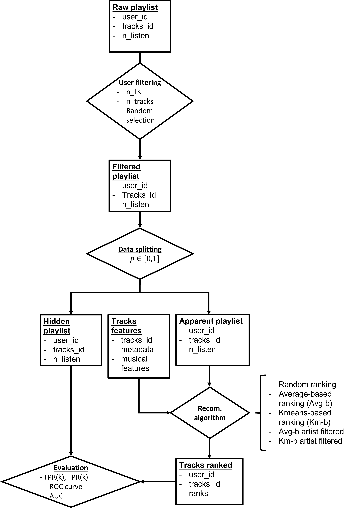
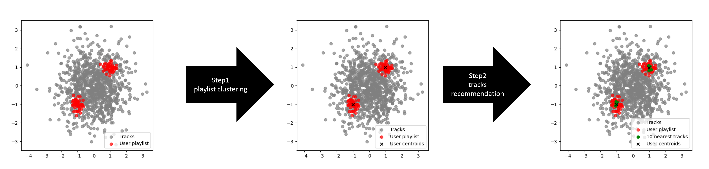
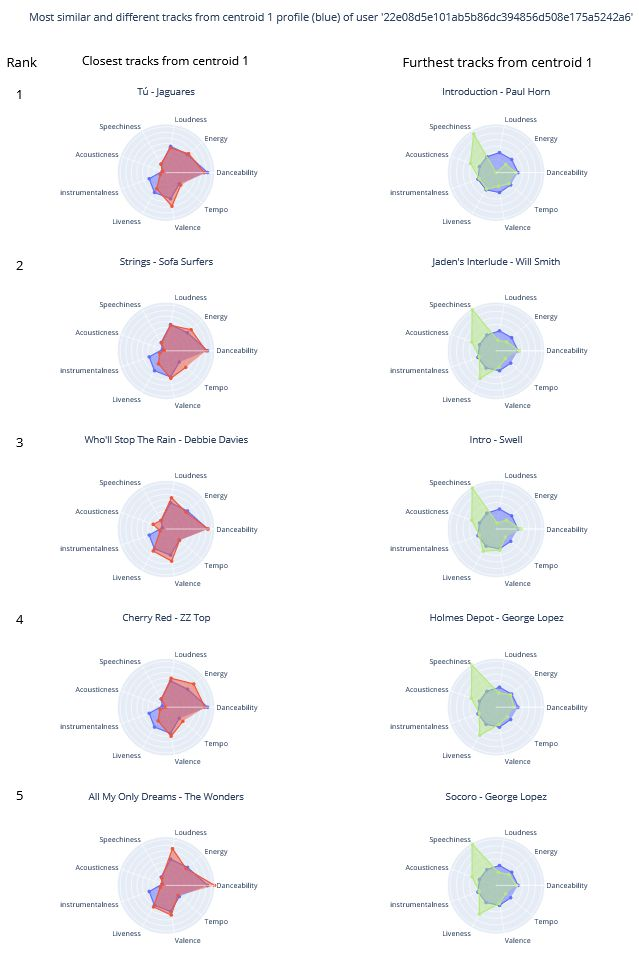
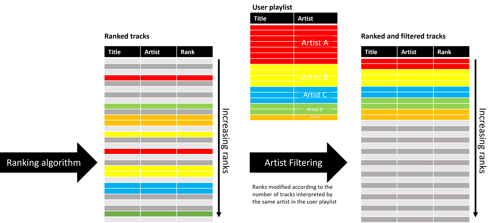
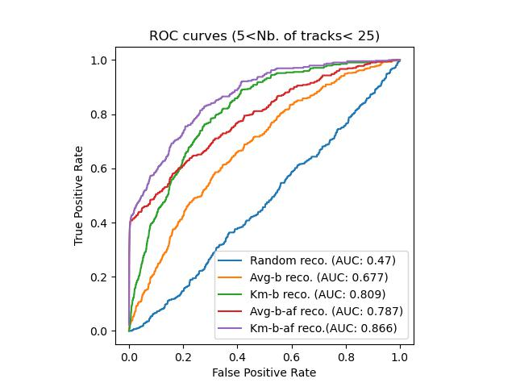
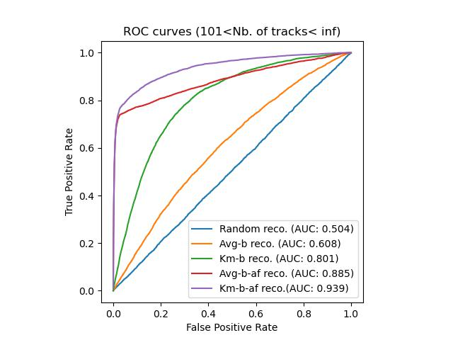

# common_vibes

## Definition and objectives


Hi there! **common_vibes** is a Data Science project aiming to build a musical recommander system. It is based on the [millionsong](http://millionsongdataset.com/) dataset 
that we enriched with a large spotify dataset containing more than 600,000 tracks with corresponding acoustic characteristics. The overall goal of this project was multifold and based on two fundamental questions:

- **How to evaluate a recommander system since actual data corresponding to listening events of users are finite and timely limited in a dataset while future listenings and potential feedback on putative recommandations are unknown.**


- **The second question was seen as a test hypothesis that is actually not trivial: does the acoustic characteristics of songs actually matter in the preferences of users playlists or not?** 


## Means


To fulfill those goals we first designed several algorithms to split at random the listening events of each users into hidden and apparent playlists as in a classical train/test split based on several filtering criterion such as the minimum and maximum number of distinct songs listened by each users and the total number of songs listenings all tracks confounded. 

<p> <br>


<center></center>


<p> <br>
<p> <br>

In the context of a Top-K recommandation problem, we then developped ranking algorithms by explicitly feeding for a user the number of listenings of each track of the hidden playlist as weights to the Kmeans algorithm sample_weight argument in order to obtain n centroids profiles of acoustic characteristics per user and analytically solved the Top-k recommandation problem by computing distance matrices between the acoustic profile of each user centroid and the acoutic characteristics of each song present in the database (except for the ones belonging to the user apparent playlist in order to avoid recommanding already listened songs). Ranking was then applied according to the results of those distances matrices, which implies the existence of same ranks for different tracks/centroids couples. 

<p> <br>
<p> <br>



<p> <br>
<p> <br>

<center></center> 

<p> <br>


An add-on filter function allowed to re-order the ranks initially attributed via clustering by identifying the artists and their importance in each user apparent playlist in order to propose to a user the tracks that he has "not listened" from an artist that he appreciates by forcing the ranks of the same artists tracks absent from the apparent playlist to occupy the first places 1: according to the importance of each artist in the apparent playlist and 2: for a given artist, by attributing the first rank to the track having initially the minimal distance from centroid profiles. This add-on filtering implies in the case of artist-filtered algorithms that there is not a single similar rank for each of the tracks recommended to the user from the songs database.     

<p> <br>



<p> <br>


## Results

Finally, we evaluated the performances of our ranking algorithms and compared them to random recommandations by computing True and False positive rates as sensitivity and specificity measures of ROC curves and their respective AUC by sub-dividing into 5 classes samples of 200 users, ranging from the classical cold-starters who did not listen many songs to regular users having listened more than a hundred different tracks.

<p> <br>




Legend:
- Random reco. : Recommandations after random ranking attribution
- Avg-b reco. : Recommandations after *Average-based* ranking attribution
- Km-b reco. : Recommandations after *Kmeans-based* ranking attribution
- \{algo_name\}-af reco. : Recommandations after *artist rank filtering*  

<p> <br>

- The larger the number of different  tracks listened, the better the performances of each algorithm is excepted for the random recommandation and for the one based on the weighted average acoustic profile (respective blue and orange traces)
- Throughout each sub-group, even if only two are presented here, the *performance trends* are the same between algorithms
- For the first group of small listeners on the left, the algorithms performance is weaker and noisy, which illustrates the problem of *cold-starters*
- For the regular users group on the right composed of users having listened more than 100 different tracks, combination of *K-means-based* clustering and *artist-filtered* ranks reordering *reaches an Area under Curve of 0.939* and shows that *by proposing barely 2% of the database songs, on average 80% of the hidden playlist of the users is proposed by the recommander algorithm, hence 80% of sensitivity for 98% of specificity*. Since we couldn't find any similar attempt aiming at dividing into apparent and hidden splits the playlists of users of the millionsong dataset and propose a recommander system based on the affinity of the users for the acoustic characteristics of their playlist, the approach developped here brings some novelty and comparison with *state of the art* performances cannot be outlined.

Overall:
- All algorithms > random recommandation
- *Kmeans-based ranking* > *Average-based ranking*
- *Artist filtering* > *without filtering*
- Beware of "pure" performance measures: little serendipity and bubble effect although the pure *K-means-based* algorithm offers room for original suggestions outside the scope of performance
- Our test hypothesis is validated: the acoustic characteristics of songs matter in the preferences of users playlists (check out the kmeans-based ranking algorithm in green) but this is not the only relevant factor  


## Content


This repository contains the code developed during our [Data Scientist training](https://datascientest.com/en/data-scientist-course) at [DataScientest](https://datascientest.com/).


Contributors :

- Benoît Le Bec ([GitHub](https://github.com/blebec) / [LinkedIn](https://www.linkedin.com/in/benoît-le-bec-59868284))
- Pierre Drouin ([GitHub](https://github.com/p-drouin) / [LinkedIn](https://fr.linkedin.com/in/pierre-drouin-6052b614a))

You can browse and run the [notebooks](./notebooks)

- user_playlist_utils : contains 2 functions to 1. summarise the listening history of users returning a dataframe containing the number of total listenings of users and the number of different tracks listened 2. filter this resulting dataframe according to threshold values.

- ranking_algotithms_utils: 3 functions to 1. get the optimal number of cluster for a given user, 2. compute the centroids of this partition and rank each track of the database absent from the user apparent playlist according to the distance of each track acoustic characteristics to those centroids and 3. re-rank those attributions accordings to the artist importance detected in the user apparent playlist.

- evaluation_workflow: 1 function to split a user listening history in apparent and hidden playlists, returns 2 dataframes 

- ranking_algorithm_evaluation: 1.Based on the functions described above, create and save results of ranked playlist for users based on distinct ranking algorithms 2. calculate true positive and false positive rates of the distinct algorithms results 3.plot average ROC curves and compute AUC of the users sample results. 


- dataviz_user_feats: plot users/tracks interactions as the number of different tracks and listenings by user.

- dataviz_tracks_feats: plot the correlations, PCA components, HAC clustering of the acoustic characteristics of the database songs and illustrates the euclidean distance matrix of a user centroids acoustic characteristics  thei the ones of the database songs under the form of radar plots. 

- ranking_algorithms_principle: illustrates in details the process of combining functions to obtain k-means based ranking of a user selected from the user summary and the impact of applying an artist filtering re-ranking in the final recommandation process.

- kmeans_ranking_principle: regardless of apparent/hidden playlists, from the selection of the optimal number of cluster and visualization of the silhouette score of a given user, calculate and display the number of songs actually listened by the user and captured by the k-means based algorithm by proposing the 5 closest neighbors to each cluster and visualize the result with corresponding radar plots.

- compose_millionsong_dataset: load and compose the enriched millionsong dataset from its different source files and a spotify dataset. If you are only interested in loading the same dataset as us, directly jump to the end of the notebook.


Datas under the form of 14 csv files enabling to recompose the same dataset as ours are available at [data/millionsong](./data/millionsong/).


## Installation and use

**To get the development version:**

```shell
mkdir common_vibes
cd common_vibes
git clone https://github.com/DataScientest-Studio/AVR23_BDS_reco_musicale.git
```

**Create your dedicated environment and install dependencies**

According to your OS and Python installation

```shell
py -<python version> -m venv env
source env/Scritpt/activate
pip install -r requirements.txt
```

**Launch the Streamlit App**
```shell
cd streamlit_app/streamlit/
streamlit run musicreco.py
```
The app should then be available at [localhost:8501](http://localhost:8501).


## Credits 

The algorithms and approach of this project were developped by Benoît Le Bec and Pierre Drouin. If you use parts or all of the work presented here, please cite us.

[https://www.markdownguide.org/hacks/]: # 